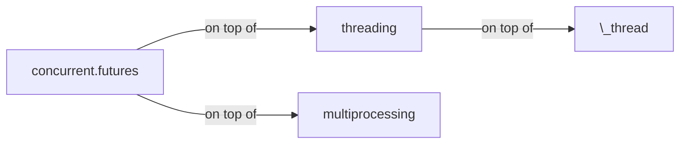

---  
layout: single  
classes: wide  
title: Difference Between Machine Learning or Deep Learning Model and a normal computer program?  
date: 2022-05-05 14:05:00 +05:30  
excerpt: Test excerpt
header:  
  teaser: assets/images/blog/computer-program-ml-dl-compare.jpg  
  caption: Image Credits Unsplash  
categories:  
 - Technology  
tags:  
 - machine learning  
 - deep learning  
 - computer program  
 - Artificial Intelligence  
---  

  
 Data Science, Machine Learning, Deep Learning and Artificial Intelligence are a few of the buzzwords in the current times. Let's see how machine learning and deep learning models different from normal computer programs.  


graph LR
  concurrent.futures --->| on top of | threading
  concurrent.futures --->| on top of | multiprocessing
  threading --->| on top of | \_thread
  click concurrent.futures "https://docs.python.org/3.9/library/concurrent.futures.html" _blank

